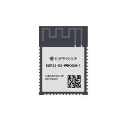
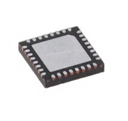
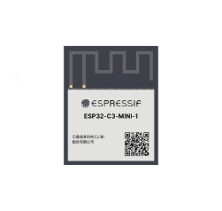
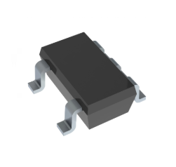
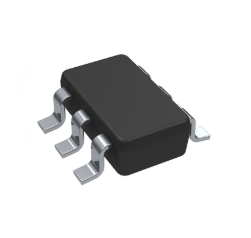
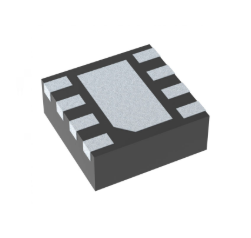

Table1. ESP32

| **Solution**                                                                                                                                                                                             |**Pros**                                                                                                                                                      |**Cons**                                                                                                            |
| -------------------------------------------------------------------------------------------------------------------------------------------------------------------------------------------------------- | ------------------------------------------------------------------------------------------------------------------------------------------------------------ | ------------------------------------------------------------------------------------------------------------------ |
|  <ul><li>Option 1 - ESP32-S3-WROOM-1</li><li>Price - $2.95</li><li>[Link](https://www.digikey.com/en/products/detail/espressif-systems/ESP32-S3-WROOM-1-N4/16162639) </li></ul> | <ul><li>Easily Progarmmable with MPLAB XIDE</li><li>Has numerous amounts of GPIO pins for multiple uses (debugging)</li><li>High Data Rate 150Mbps</li></ul> | <ul><li>Most Expensive</li><li>Difficulty with Soldering to Board</li><li>One Set Frequency Range 2.4GHz</li></ul> | 
|  <ul><li>Option 2 - ESP32-C3FH4</li><li>Price - $1.30</li><li>[Link](https://www.digikey.com/en/products/detail/espressif-systems/ESP32-C3FH4/14115592)</li></ul>              | <ul><li>Cheaper Price</li><li>Higher Freqency Range 2.402GHz ~ 2.48GHz</li><li>Capable with Bluetooth V5.0</li></ul>                                         | <ul><li>No ADC Pins located on Board</li><li>Lowest Data Rate 54Mbps</li><li>No Antenna Type Indluded</li></ul>    |
|  <ul><li>Option 3 - ESP32-C3-MINI-1</li><li>Price - $1.80</li><li>[Link](https://www.digikey.com/en/products/detail/espressif-systems/ESP32-C3-MINI-1-N4/13877574)</li></ul>    | <ul><li>Cheaper Price</li><li>Easily Progarmmable with MPLAB XIDE</li><li>High Data Rate 150Mbps</li></ul>                                                   | <ul><li>Difficult Surface Mount</li><li>Not developed for New Designs</li><li>Difficult to Program</li></ul>       |

**Choice:** - Option 1

**Rationale:** - 

| **Solution**                                                                                                                                                                                             |**Pros**                                                      |**Cons**                                                      |
| -------------------------------------------------------------------------------------------------------------------------------------------------------------------------------------------------------- | ------------------------------------------------------------ | ------------------------------------------------------------ |
|  <ul><li>Option 1 - LM3671MF-3.3/NOPB</li><li>Price - $1.56</li><li>[Link](https://www.digikey.com/en/products/detail/texas-instruments/LM3671MF-3-3-NOPB/1590062) </li></ul>  | <ul><li>Bullet 1</li><li>Bullet 2</li><li>Bullet 3</li></ul> | <ul><li>Bullet 1</li><li>Bullet 2</li><li>Bullet 3</li></ul> | 
|  <ul><li>Option 2 - TLV61048DBVR</li><li>Price - $0.63</li><li>[Link](https://www.digikey.com/en/products/detail/texas-instruments/TLV61048DBVR/10715594)</li></ul>           | <ul><li>Bullet 1</li><li>Bullet 2</li><li>Bullet 3</li></ul> | <ul><li>Bullet 1</li><li>Bullet 2</li><li>Bullet 3</li></ul> |
|  <ul><li>Option 3 - TPS62082DSGR</li><li>Price - $1.55</li><li>[Link](https://www.digikey.com/en/products/detail/texas-instruments/TPS62082DSGR/2797959)</li></ul>             | <ul><li>Bullet 1</li><li>Bullet 2</li><li>Bullet 3</li></ul> | <ul><li>Bullet 1</li><li>Bullet 2</li><li>Bullet 3</li></ul> |

**Choice:** - Option 1

**Rationale:** - 

| ESP Info                                      | Answer                                                                                                                   | Help                                                                                                      |
| --------------------------------------------- | ------------------------------------------------------------------------------------------------------------------------ | --------------------------------------------------------------------------------------------------------- |
| Model                                         | ESP32-S3-WROOM-1-N4                                                                                                      | Include the entire part number (leave off any letters at the end that specify the package type)           |
| Product Page URL                              | [Main Product Page](https://www.digikey.com/en/supplier-centers/espressif-systems)                                       | Found on Espressif.com                                                                                    |
| ESP32-S3-WROOM-1-N4 Datasheet URL             | [Datasheet](https://www.espressif.com/sites/default/files/documentation/esp32-s3-wroom-1_wroom-1u_datasheet_en.pdf)      | Do not paste links directly into the table.  Use a [link](#)                                              |
| ESP32 S3 Datasheet URL                        | [Datasheet](https://www.espressif.com/sites/default/files/documentation/esp32-s3_datasheet_en.pdf)                       | Has more detail on functions                                                                              |
| ESP32 S3 Technical Reference Manual URL       | [Manual](https://docs.espressif.com/projects/esp-hardware-design-guidelines/en/latest/esp32s3/hardware-development.html) | Has details on I/O multiplexing, USB, and others                                                          |
| Vendor link                                   | [Vendor:Digikey](https://www.digikey.com/en/products/detail/espressif-systems/ESP32-S3-WROOM-1-N4/16162639)              | Digikey, Jameco, etc.  Do not paste links directly into the table.  Use a [link](#)                       |
| Code Examples                                 | [LED & Button Code-Github](https://github.com/esp-arduino-libs/ESP32_Button)                                             | url(s) for libraries on github or other sites related to the microcontroller and your planned peripherals |
| External Resources URL(s)                     | [LED & Button ESP32](https://medium.com/@madeadhika39/turn-on-led-on-esp32-with-push-button-8c8ee1b3652f)                | Search on Google and YouTube for other resources for each specific microcontroller.                       |
| Unit cost                                     | $2.95                                                                                                                    | Find on Digikey, Jameco, MPJA, or octopart                                                                |
| Absolute Maximum Current for entire IC        | 50nA                                                                                                                     | Find in the microcontroller datasheet                                                                     |
| Supply Voltage Range                          | 3.0-3.6V                                                                                                                 | Min / Nominal / Max / Absolute Max, as found in datasheet                                                 |
| Absolute Maximum current   (for entire IC) | 50nA                                                                                                                     | as found in datasheet                                                                                     |
| Maximum GPIO current   (per pin)           | 50nA                                                                                                                     | as found in datasheet                                                                                     |
| Supports External Interrupts?                 | Yes                                                                                                                      | as found in datasheet                                                                                     |
| Required Programming Hardware, Cost, URL      | MPLAB XIDE Hardware, Provided by School, N/A                                                                             | as found in datasheet                                                                                     |

| Module         | # Available | Needed | Associated Pins (or * for any) |
| -------------- | ----------- | ------ | ------------------------------ |
| UART           | 4           | 4      | RX0/2, TX0/2                   |
| external SPI\* | 12          | 2      | N/A                            |
| I2C            | 36          | 4      | GPIO6, GPIO8, GPIO10, GPIO12   |
| GPIO           | 36          | 1      | GPIO4, GPIO6                   |
| ADC            | 18          | 0      | N/A                            |
| LED PWM        | 36          | 1      | GPIO4                          |
| Motor PWM      | 36          | 0      | N/A                            |
| USB Programmer | 1           | 1      | 1 Plug-In USB 3.0              |

\* The ESP32-S2 has multiple SPI interfaces, but some are for internal use
