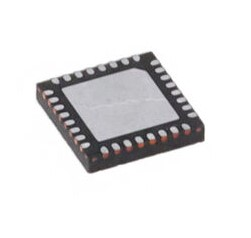

Table1. ESP32
| Solution           |      Pros      |      Cons       |
| ------------------------------------------------------------------------------------------------------------------------------------------------------------------------------------------------------------------------------------------------------------------ | ------------------------------------------------------------ | ------------------------------------------------------------ |
|  <ul><li>Option 1 - ESP32-S3-WROOM-1</li><li>Price - $2.95</li><li>[Link](https://www.digikey.com/en/products/detail/espressif-systems/ESP32-S3-WROOM-1-N4/16162639) </li></ul> | <ul><li>Bullet 1</li><li>Bullet 2</li><li>Bullet 3</li></ul> | <ul><li>Bullet 1</li><li>Bullet 2</li><li>Bullet 3</li></ul> | 
|  <ul><li>Option 2 - ESP32-C3FH4</li><li>Price - $1.30</li><li>[Link](https://www.digikey.com/en/products/detail/espressif-systems/ESP32-C3FH4/14115592)</li></ul> | <ul><li>Bullet 1</li><li>Bullet 2</li><li>Bullet 3</li></ul> | <ul><li>Bullet 1</li><li>Bullet 2</li><li>Bullet 3</li></ul> |
|                  | <ul><li>Bullet 1</li><li>Bullet 2</li><li>Bullet 3</li></ul> | <ul><li>Bullet 1</li><li>Bullet 2</li><li>Bullet 3</li></ul> |

| ESP Info                                      | Answer | Help                                                                                                      |
| --------------------------------------------- | ------ | --------------------------------------------------------------------------------------------------------- |
| Model                                         | ?      | Include the entire part number (leave off any letters at the end that specify the package type)           |
| Product Page URL                              | ?      | Found on Espressif.com                                                                                    |
| ESP32-S3-WROOM-1-N4 Datasheet URL             | ?      | Do not paste links directly into the table.  Use a [link](#)                                              |
| ESP32 S3 Datasheet URL                        | ?      | Has more detail on functions                                                                              |
| ESP32 S3 Technical Reference Manual URL       | ?      | Has details on I/O multiplexing, USB, and others                                                          |
| Vendor link                                   | ?      | Digikey, Jameco, etc.  Do not paste links directly into the table.  Use a [link](#)                       |
| Code Examples                                 | ?      | url(s) for libraries on github or other sites related to the microcontroller and your planned peripherals |
| External Resources URL(s)                     | ?      | Search on Google and YouTube for other resources for each specific microcontroller.                       |
| Unit cost                                     | ?      | Find on Digikey, Jameco, MPJA, or octopart                                                                |
| Absolute Maximum Current for entire IC        | ?      | Find in the microcontroller datasheet                                                                     |
| Supply Voltage Range                          | ?      | Min / Nominal / Max / Absolute Max, as found in datasheet                                                 |
| Absolute Maximum current   (for entire IC) | ?      | as found in datasheet                                                                                     |
| Maximum GPIO current   (per pin)           | ?      | as found in datasheet                                                                                     |
| Supports External Interrupts?                 | ?      | as found in datasheet                                                                                     |
| Required Programming Hardware, Cost, URL      | ?      | as found in datasheet                                                                                     |

| Module         | # Available | Needed | Associated Pins (or * for any) |
| -------------- | ----------- | ------ | ------------------------------ |
| UART           | ?           | ?      | ?                              |
| external SPI\* | ?           | ?      | ?                              |
| I2C            | ?           | ?      | ?                              |
| GPIO           | ?           | ?      | ?                              |
| ADC            | ?           | ?      | ?                              |
| LED PWM        | ?           | ?      | ?                              |
| Motor PWM      | ?           | ?      | ?                              |
| USB Programmer | ?           | 1      | ?                              |
| ...            |

\* The ESP32-S2 has multiple SPI interfaces, but some are for internal use
