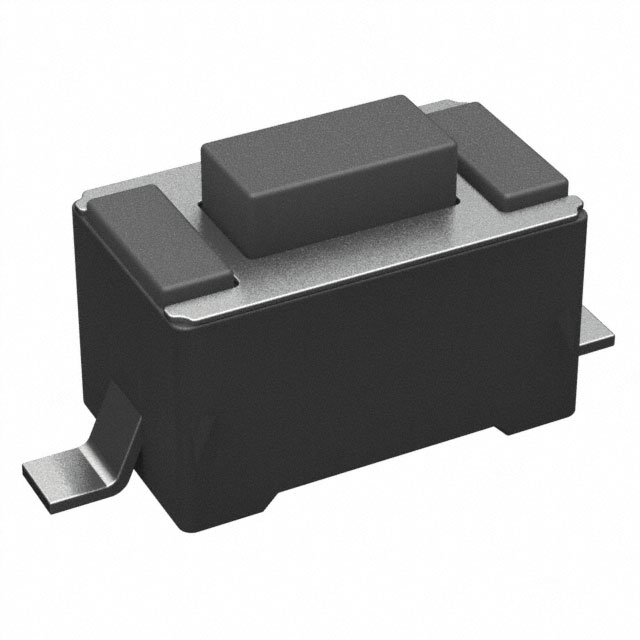
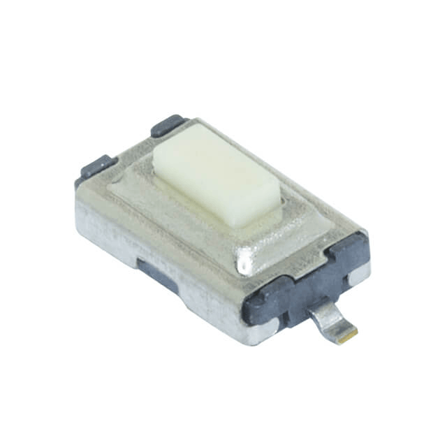

## **Table1. ESP32**

| **Solution**                                                                                                                                                                                             |**Pros**                                                                                                                                                      |**Cons**                                                                                                            |
| -------------------------------------------------------------------------------------------------------------------------------------------------------------------------------------------------------- | ------------------------------------------------------------------------------------------------------------------------------------------------------------ | ------------------------------------------------------------------------------------------------------------------ |
|  <ul><li>Option 1 - ESP32-S3-WROOM-1</li><li>Price - $2.95</li><li>[Link](https://www.digikey.com/en/products/detail/espressif-systems/ESP32-S3-WROOM-1-N4/16162639) </li></ul> | <ul><li>Easily Progarmmable with MPLAB XIDE</li><li>Has numerous amounts of GPIO pins for multiple uses (debugging)</li><li>High Data Rate 150Mbps</li></ul> | <ul><li>Most Expensive</li><li>Difficulty with Soldering to Board</li><li>One Set Frequency Range 2.4GHz</li></ul> | 
|  <ul><li>Option 2 - ESP32-C3FH4</li><li>Price - $1.30</li><li>[Link](https://www.digikey.com/en/products/detail/espressif-systems/ESP32-C3FH4/14115592)</li></ul>              | <ul><li>Cheaper Price</li><li>Higher Freqency Range 2.402GHz ~ 2.48GHz</li><li>Capable with Bluetooth V5.0</li></ul>                                         | <ul><li>No ADC Pins located on Board</li><li>Lowest Data Rate 54Mbps</li><li>No Antenna Type Indluded</li></ul>    |
|  <ul><li>Option 3 - ESP32-C3-MINI-1</li><li>Price - $1.80</li><li>[Link](https://www.digikey.com/en/products/detail/espressif-systems/ESP32-C3-MINI-1-N4/13877574)</li></ul>    | <ul><li>Cheaper Price</li><li>Easily Progarmmable with MPLAB XIDE</li><li>High Data Rate 150Mbps</li></ul>                                                   | <ul><li>Difficult Surface Mount</li><li>Not developed for New Designs</li><li>Difficult to Program</li></ul>       |

**Choice:** - Option 1

> Rationale: - We chose the first one since we are the most familiar with the ESP32, along with the multiple GPIO pins it has which would be the largest along with the most UART pins needed for my personal subsytem of the internet connection to our product and mobile phones. 

## **Table2. Voltage Regulator**

| **Solution**                                                                                                                                                                                             |**Pros**                                                                                                                       |**Cons**                                                                                                                       |
| -------------------------------------------------------------------------------------------------------------------------------------------------------------------------------------------------------- | ----------------------------------------------------------------------------------------------------------------------------- | ----------------------------------------------------------------------------------------------------------------------------- |
|  <ul><li>Option 1 - LM3671MF-3.3/NOPB</li><li>Price - $1.56</li><li>[Link](https://www.digikey.com/en/products/detail/texas-instruments/LM3671MF-3-3-NOPB/1590062) </li></ul>  | <ul><li>Output type is fixed to 3.3V</li><li>To be used as a Step Down Function</li><li>Dependable for High voltage</li></ul> | <ul><li>Max Input Voltage of 5.5V</li><li>High Operating Temp (Gets hot)</li><li>One output for Voltage End</li></ul>         | 
|  <ul><li>Option 2 - TLV61048DBVR</li><li>Price - $0.63</li><li>[Link](https://www.digikey.com/en/products/detail/texas-instruments/TLV61048DBVR/10715594)</li></ul>           | <ul><li>Lowest Frequency</li><li>Durable Switching Mechanism</li><li>Lowest cost of Three</li></ul>                           | <ul><li>Output type is not fixed to 3.3V (Adjustable)</li><li>High Current 3.7A</li><li>Higher Cost</li></ul>                 |
|  <ul><li>Option 3 - TPS62082DSGR</li><li>Price - $1.55</li><li>[Link](https://www.digikey.com/en/products/detail/texas-instruments/TPS62082DSGR/2797959)</li></ul>             | <ul><li>Output type is fixed to 3.3V</li><li>Highest Input Voltage of 6V</li><li>Current Output 1.2A</li></ul>                | <ul><li>Difficult Soldering</li><li>Connection to Eight Pins makes difficulty of Datasheet Pins</li><li>Higher Cost</li></ul> |

**Choice:** - Option 1

> Rationale: - The first one is the easiest to solder with it having 5 pins total comapred to the six of the second choice and eight plus bottom pad of the third choice, we also chose this one due to its advantages of lowest current of 600mA and a fixed voltage of 3.3 to not worry about going over the limit.

## **Table3. Push Button**

| **Solution**                                                                                                                                                                                                                         |**Pros**                                                                                                                          |**Cons**                                                                                             |
| ------------------------------------------------------------------------------------------------------------------------------------------------------------------------------------------------------------------------------------ | -------------------------------------------------------------------------------------------------------------------------------- | --------------------------------------------------------------------------------------------------- |
|  <ul><li>Option 1 - PTS636SM43SMTR LFS</li><li>Price - $0.18</li><li>[Link](https://www.digikey.com/en/products/detail/c-k/PTS636SM43SMTR-LFS/10071723) </li></ul>                                        | <ul><li>Push button is fixed to OFF-MOM</li><li>Cheap price, can be bought in bulk</li><li>Easy soldering component</li></ul>    | <ul><li>Long Delivery Time</li><li>Non Illuminating Button</li><li>Small package size</li></ul>     | 
|  <ul><li>Option 2 - FSM2JMTR</li><li>Price - $0.37</li><li>[Link](https://www.digikey.com/en/products/detail/te-connectivity-alcoswitch-switches/FSM2JMTR/1201456)</li></ul>                             | <ul><li>Push button is fixed to OFF-MOM</li><li>Durable Switching Mechanism</li><li>Cheap price, can be bought in bulk</li></ul> | <ul><li>Long Delivery Time</li><li>Difficult undersoldering</li><li>Smallest package size</li></ul> |
|  <ul><li>Option 3 - TS09-63-25-WT-160-SMT-TR</li><li>Price - $0.23</li><li>[Link](https://www.digikey.com/en/products/detail/same-sky-formerly-cui-devices/TS09-63-25-WT-160-SMT-TR/15839066)</li></ul>   | <ul><li>Push button is fixed to OFF-MOM</li><li>Cheap price, can be bought in bulk</li><li>Decent button size</li></ul>          | <ul><li>Long Delivery Time</li><li>Non Illuminating Button</li><li>Small package size</li></ul>     |

**Choice:** - Option 1

> Rationale: - The first choice was the best option with the ability to be soldered easier than the other two options along with being the most noticible button with the dark design and use.

## **Table4. ESP32 Model**

| ESP Info                                      | Answer                                                                                                                   | Help                                                                                                      |
| --------------------------------------------- | ------------------------------------------------------------------------------------------------------------------------ | --------------------------------------------------------------------------------------------------------- |
| Model                                         | ESP32-S3-WROOM-1-N4                                                                                                      | Include the entire part number (leave off any letters at the end that specify the package type)           |
| Product Page URL                              | [Main Product Page](https://www.digikey.com/en/supplier-centers/espressif-systems)                                       | Found on Espressif.com                                                                                    |
| ESP32-S3-WROOM-1-N4 Datasheet URL             | [Datasheet](https://www.espressif.com/sites/default/files/documentation/esp32-s3-wroom-1_wroom-1u_datasheet_en.pdf)      | Do not paste links directly into the table.  Use a [link](#)                                              |
| ESP32 S3 Datasheet URL                        | [Datasheet](https://www.espressif.com/sites/default/files/documentation/esp32-s3_datasheet_en.pdf)                       | Has more detail on functions                                                                              |
| ESP32 S3 Technical Reference Manual URL       | [Manual](https://docs.espressif.com/projects/esp-hardware-design-guidelines/en/latest/esp32s3/hardware-development.html) | Has details on I/O multiplexing, USB, and others                                                          |
| Vendor link                                   | [Vendor:Digikey](https://www.digikey.com/en/products/detail/espressif-systems/ESP32-S3-WROOM-1-N4/16162639)              | Digikey, Jameco, etc.  Do not paste links directly into the table.  Use a [link](#)                       |
| Code Examples                                 | [LED & Button Code-Github](https://github.com/esp-arduino-libs/ESP32_Button)                                             | url(s) for libraries on github or other sites related to the microcontroller and your planned peripherals |
| External Resources URL(s)                     | [LED & Button ESP32](https://medium.com/@madeadhika39/turn-on-led-on-esp32-with-push-button-8c8ee1b3652f)                | Search on Google and YouTube for other resources for each specific microcontroller.                       |
| Unit cost                                     | $2.95                                                                                                                    | Find on Digikey, Jameco, MPJA, or octopart                                                                |
| Absolute Maximum Current for entire IC        | 50nA                                                                                                                     | Find in the microcontroller datasheet                                                                     |
| Supply Voltage Range                          | 3.0-3.6V                                                                                                                 | Min / Nominal / Max / Absolute Max, as found in datasheet                                                 |
| Absolute Maximum current   (for entire IC) | 50nA                                                                                                                     | as found in datasheet                                                                                     |
| Maximum GPIO current   (per pin)           | 50nA                                                                                                                     | as found in datasheet                                                                                     |
| Supports External Interrupts?                 | Yes                                                                                                                      | as found in datasheet                                                                                     |
| Required Programming Hardware, Cost, URL      | MPLAB XIDE Hardware, Provided by School, N/A                                                                             | as found in datasheet                                                                                     |

| Module         | # Available | Needed | Associated Pins (or * for any) |
| -------------- | ----------- | ------ | ------------------------------ |
| UART           | 4           | 4      | RX0/2, TX0/2                   |
| external SPI\* | 12          | 0      | N/A                            |
| I2C            | 36          | 4      | GPIO6, GPIO8, GPIO10, GPIO12   |
| GPIO           | 36          | 1      | GPIO4, GPIO6                   |
| ADC            | 18          | 0      | N/A                            |
| LED PWM        | 36          | 1      | GPIO4                          |
| Motor PWM      | 36          | 0      | N/A                            |
| USB Programmer | 1           | 1      | 1 Plug-In USB 3.0              |

| **Summary Components**                                                                                                                                                                                   |
| -------------------------------------------------------------------------------------------------------------------------------------------------------------------------------------------------------- |
|  <ul><li>Option 1 - ESP32-S3-WROOM-1</li><li>Price - $2.95</li><li>[Link](https://www.digikey.com/en/products/detail/espressif-systems/ESP32-S3-WROOM-1-N4/16162639) </li></ul> |
|  <ul><li>Option 1 - LM3671MF-3.3/NOPB</li><li>Price - $1.56</li><li>[Link](https://www.digikey.com/en/products/detail/texas-instruments/LM3671MF-3-3-NOPB/1590062) </li></ul>  |

## **Decision Making Process**
* We chose the first one since we are the most familiar with the ESP32, along with the multiple GPIO pins it has which would be the largest along with the most UART pins needed for my personal subsytem of the internet connection to our product and mobile phones. The first one is the easiest to solder with it having 5 pins total comapred to the six of the second choice and eight plus bottom pad of the third choice, we also chose this one due to its advantages of lowest current of 600mA and a fixed voltage of 3.3 to not worry about going over the limit.

## **Power Budget**

# **Power Budget Conclusion**
* From the Power Budget that I made earlier this semester, I have determined the range of power needed to power all I need to power would range from 3V to 5.5V that the voltage regulator would accept at a max voltage and for the ESP32 to accept at a max voltage. This meant that I had to use a 5V plug in to power all of my equipment or that I could use the default 5V usb plug in device to power and program the ESP32.
