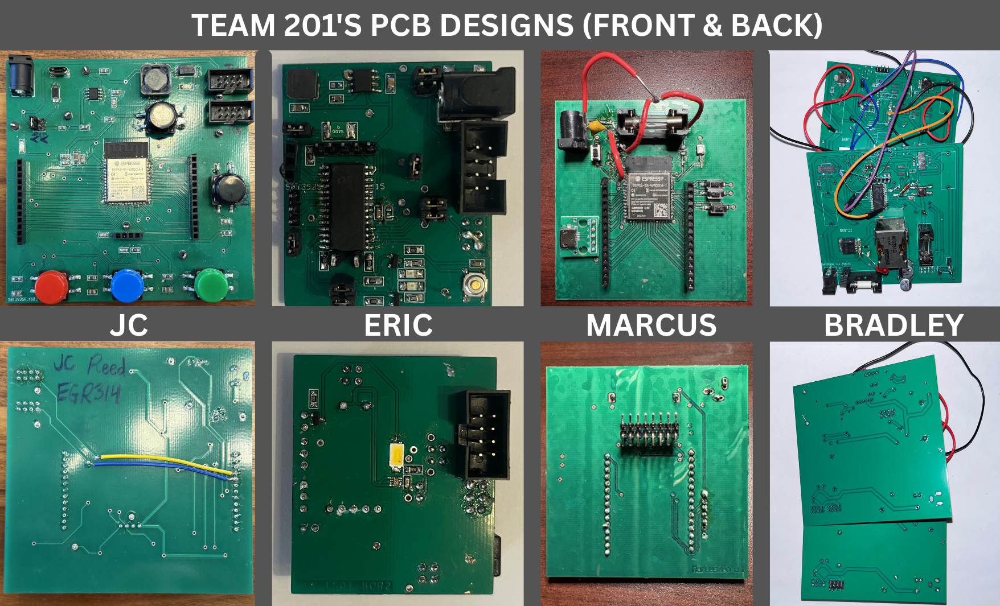

## **HQTT Subsystem Schematic**

## **PCB Pictures**
* Front

* Back

[Final Schematic PDF](static/FinalSchematic.pdf)

[Final ECAD Project ZIP](static/OverallSchematic.zip)

[Gerber Files](static/Gerber5.zip)

## **Team Final PCB Photos**

## **Functionality**
* This schematic satisfies the condition of being able to communicate with my teammate's boards along with connecting to the ASU MQTT server in order to have messages sent from the MQTT explorer and passed around my teammate's through the daisy chain. The MQTT we initially designed to display a message that is passed, but that proved to be too difficult with the amount of time we had, so we offered to use the MQTT as a debugging tool or as a reset button controlled from a wireless connection rather than hitting the reset button on a teammate's board.

## **Team Design/Decision Making**
* We initially wanted the MQTT to display the messages to display that were passed and received onto a mobile device and shown on said mobile device in order to see what the user was implementing for their decisions. This was changed due to complications of finding an app on the phone to allow the display of the messages along with the HMI system having its own LCD screen to display rather than using the MQTT due to the long time problem solving and complications of applications with phones. This meant that we used the MQTT as a debugging tool to "spoof" messages to check for continuity between boards and for a wireless reset function instead of pushing it on someone's board.

## **How it could Improve**
* This project could improve with the implementation of better components which would be larger than the ones I selected for my PCB. Due to the difficult size of the components I selected with them being way smaller than I had intended to use, they gave me much trouble to solder on the pieces to my board along with little spacing to have room for decent placing or removing. Another improvement that I would’ve like to make would be the spacing between my components on my board, since everything was so compact together it did not allow for the easy placement and removal of my parts with soldering. This gave me trouble with connecting my voltage regulator since it was so small and all the pieces were compacted together in a tight space with little to no room for soldering to be effective. I would’ve also decided to make the Voltage regulator separate from my board on a smaller board which could connect to my larger board to allow for more room to place my pieces and allow for more space to stretch out my primary board with the ESP32. Given how crudely my board was made, I would’ve liked to improve the way my board had soldering mask mistakes where I had to scratch off some of the solder mask to connect some of my pins along with being able to print more than one copy of the board in case of mistakes.
