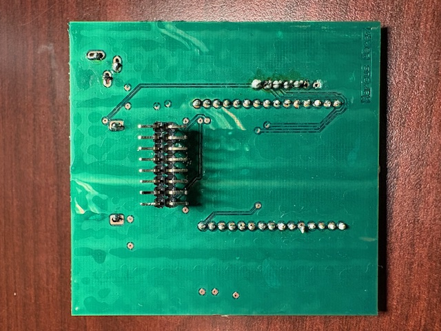

## **HQTT Subsystem Schematic**

## **PCB Pictures**
* Front

* Back

[Final Schematic PDF](static/FinalSchematic.pdf)

[Final ECAD Project ZIP](static/OverallSchematic.zip)

[Gerber Files](static/Gerber5.zip)

## **Team Final PCB Photos**
* 

## **Functionality**
* This schematic satisfies the condition of being able to communicate with my teammate's boards along with connecting to the ASU MQTT server in order to have messages sent from the MQTT explorer and passed around my teammate's through the daisy chain. The MQTT we initially designed to display a message that is passed, but that proved to be too difficult with the amount of time we had, so we offered to use the MQTT as a debugging tool or as a reset button controlled from a wireless connection rather than hitting the reset button on a teammate's board.

## **Team Design/Decision Making**
* We initially wanted the MQTT to display the messages to display that were passed and received onto a mobile device and shown on said mobile device in order to see what the user was implementing for their decisions. This was changed due to complications of finding an app on the phone to allow the display of the messages along with the HMI system having its own LCD screen to display rather than using the MQTT due to the long time problem solving and complications of applications with phones. This meant that we used the MQTT as a debugging tool to "spoof" messages to check for continuity between boards and for a wireless reset function instead of pushing it on someone's board.

## **How it could Improve**
* 
